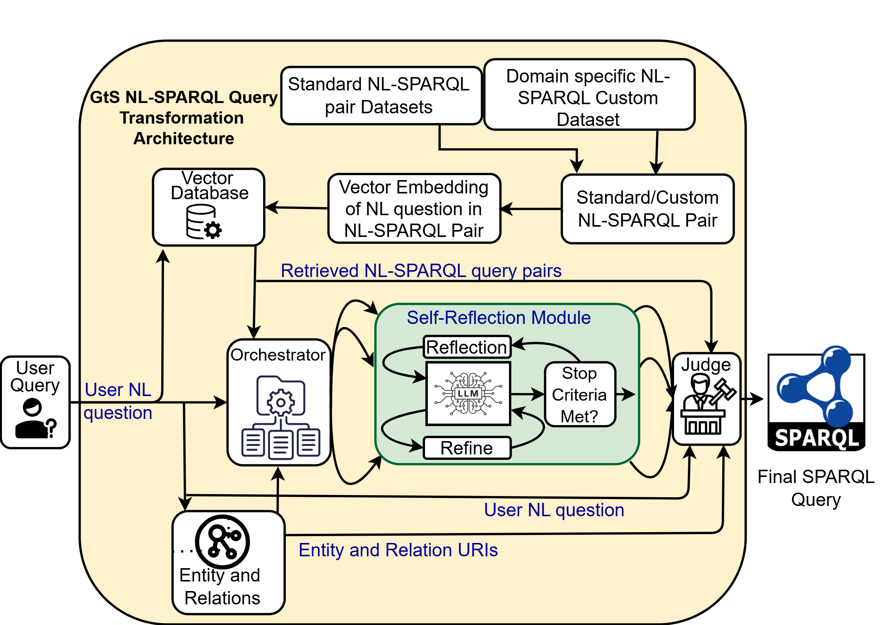
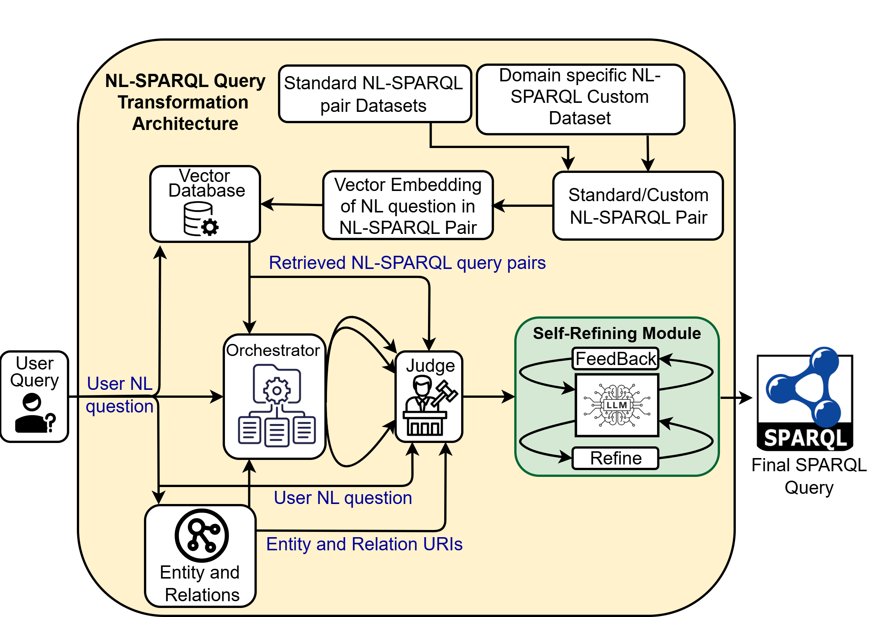

<h1>
 
Reasoning-Driven and Resource-Efficient NL2SPARQL using LLMs
</h1>


<p align="center">
  
</p>

<p align="center">
  
</p>

---

## Overview

Knowledge Graphs provide structured and semantically rich representations for information retrieval and reasoning. However, writing SPARQL queries requires familiarity with RDF schemas, URI structures, and query syntax, creating a barrier for users.

This project introduces a **reasoning-driven Natural Language to SPARQL (NL2SPARQL) framework** powered by Large Language Models (LLMs). The framework transforms natural language questions into executable SPARQL queries while improving schema grounding, reducing URI hallucinations, and maintaining strong performance in low-resource environments.

The framework proposes two complementary reasoning workflows:

* **Generation-then-Selection (GtS)**
* **Selection-then-Generation (StG)**

Both workflows leverage:

* Retrieval-Augmented Generation (RAG)
* LLM-as-a-Judge
* Iterative self-reflection
* Self-consistency inspired generation
* URI-aware prompting
* Dynamic SPARQL template construction

---

## Motivation

Existing NL2SPARQL approaches often suffer from:

* Hallucinated URIs
* Weak schema grounding
* High computational cost
* Poor generalization to unseen queries
* Dependence on large-scale models
* Limited adaptation to evolving knowledge graphs

This framework addresses these limitations by distributing reasoning across modular components and enabling deployment with consumer-grade LLMs.

---

## Core Contributions

### Multi-stage reasoning architecture

Structured generation and refinement pipeline for SPARQL generation.

### LLM-as-a-Judge mechanism

Reasoning-based selection of candidate SPARQL outputs.

### Iterative self-reflection

Progressive refinement of generated SPARQL queries.

### Resource-efficient deployment

Designed for local deployment using small and medium-sized LLMs.

### Cross-domain generalization

Supports heterogeneous knowledge graphs without domain-specific retraining.

---

# Architecture

## Generation-then-Selection (GtS)

The GtS workflow generates multiple SPARQL candidates through parallel reasoning paths.

Workflow:

1. Retrieve NL-SPARQL examples using RAG
2. Generate prompt templates
3. Produce multiple candidate SPARQL queries
4. Apply iterative self-reflection
5. Aggregate candidate outputs
6. Use LLM-as-a-Judge for final selection

Characteristics:

* Multiple candidate generation
* Strong self-consistency behavior
* Improved robustness against generation noise
* Better semantic alignment

---

## Selection-then-Generation (StG)

The StG workflow reorganizes reasoning by selecting generalized query patterns before generation.

Workflow:

1. Retrieve context using RAG
2. Generalize SPARQL patterns
3. Judge module selects template
4. Build prompt structure
5. Generate SPARQL query
6. Iteratively refine output

Characteristics:

* Reduced computational cost
* Lower generation overhead
* Strong template grounding

---

## System Components

### Orchestrator Module

Responsible for:

* RAG handling
* Prompt construction
* Pipeline management
* Candidate orchestration

### RAG Module

Uses semantic retrieval to obtain similar NL–SPARQL pairs.

Embedding model:

```
all-MiniLM-L6-v2
```

Database:

```
ChromaDB
```

### Judge Module

Uses iterative reasoning to:

* Compare candidate queries
* Validate structural consistency
* Select optimal outputs

### Self-Reflection Module

Refines outputs until convergence.

Benefits:

* Reduces variance
* Improves consistency
* Suppresses noisy outputs

---

## Project Structure

```text
.
├── assets/
│   ├── GtS_Approach.png
│   └── StG_Approach.png
│
├── data/
│   ├── standard_datasets/
│   └── custom_datasets/
│
├── rag/
├── judge/
├── orchestrator/
├── evaluation/
├── models/
└── main.py
```

---

## Datasets

| Dataset                | Knowledge Graph  |
| ---------------------- | ---------------- |
| LC-QuAD 2.0            | Wikidata         |
| VQuAnDa                | DBpedia          |
| QALD-9                 | DBpedia          |
| QALD-9 Plus            | Wikidata         |
| Custom Weather Dataset | Climate Ontology |

---

## Supported Models

* Qwen2.5-1.5B
* Qwen2.5-3B
* Qwen2.5-7B
* Qwen2.5-14B
* Llama 3.2
* Phi-4 Mini
* Granite

Quantized versions supported:

* Q4
* Q6
* Q8

---

## Installation

```bash
git clone <repo-url>

cd repository

pip install -r requirements.txt
```

---

## Running the Framework

```bash
python main.py
```

Example input:

```text
What was the highest recorded temperature in 2003?
```

Generated output:

```sparql
SELECT ?date ?val
WHERE {
...
}
```

---

## Evaluation Metrics

The framework is evaluated using:

* BLEU
* F1
* Ensemble BLEU
* Ensemble F1
* Execution F1

---

## Experimental Environment

GPU:

* RTX 4070
* RTX 3090
* RTX 4090

Framework:

* Ollama
* ChromaDB
* Sentence Transformers

---

## Citation

```bibtex
@article{nl2sparql_reasoning,
 title={Reasoning-Driven and Resource-Efficient SPARQL Query Generation Using Large Language Models}
}
```

---

## License

MIT License

---

## Acknowledgement

This work explores scalable Knowledge Graph Question Answering through reasoning-driven large language models under practical computational constraints.
